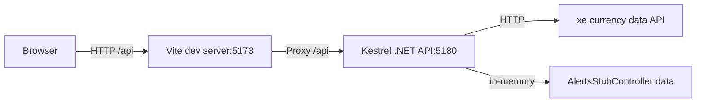

# Code Analysis and Recommended Improvements

Version: 2026-09-21

This document is an engineering review of the repository in this workspace. It summarizes the current state, identifies problems and risks, and recommends a pragmatic road map and target architecture for improvements. It is intended to be actionable and prioritized so the project can be incrementally improved while remaining runnable for the take‑home exercise.

Scope
- Backend: .NET 10 Web API in `backend/`
- Frontend: Vue 3 + Vite in `frontend/`
- Purpose: evaluate code structure, architecture, security, reliability, testing, and developer experience

Assumptions
- The repository is a take‑home starter app and must remain runnable.
- The Alerts stub controller is intentionally included for frontend work and may be replaced for backend work.
- No secrets are added to this document; the analysis notes the presence of secrets in configuration and recommends remediation.

Executive summary
- The application is small and functional but mixes responsibilities in controllers (HTTP calls, JSON parsing, business logic, in‑memory storage), performs blocking IO on async APIs, and creates multiple unmanaged HttpClient instances.
- Frontend is a single large component that directly calls `/api` and stores state in an untyped reactive object although Pinia is installed.
- Short wins: convert controllers into thin HTTP endpoints that delegate to services, use typed HttpClient via IHttpClientFactory, make external calls asynchronous and resilient, move configuration to typed options, rotate the committed API key, add basic Swagger, and introduce unit + integration tests for the backend and component tests for the frontend.

Repository snapshot

- backend/
  - Controllers/
	- RatesController.cs (fetches XE rates directly inside controller)
	- AlertsStubController.cs (in‑memory alerts stub, documented as a frontend helper)
  - Program.cs (only registers controllers)
  - appsettings.json (contains XE credentials)
- frontend/
  - src/
	- App.vue (renders rates, calls `/api/rates` directly)
	- state.ts (shared reactive state)
  - vite.config.ts (proxies `/api` to backend)

Current-state component diagram (high level)



Backend analysis

- Controller responsibilities
  - RatesController performs network calls, authentication header construction, synchronous blocking calls (.Result), JSON parsing, rounding and response shaping — multiple responsibilities in one class.
  - AlertsStubController contains domain types, validation, concurrency locking and storage. That is acceptable as a stub but not as long term design.

- HttpClient usage
  - The controller creates new `HttpClient` instances per request and per pair. This is inefficient and leads to socket exhaustion in long‑running systems.
  - Calls are executed synchronously via `.Result`, blocking thread pool threads. Convert to async/await and use IHttpClientFactory/typed clients.

- Configuration & secrets
  - XE credentials are present in `backend/appsettings.json`. This is sensitive and must be rotated and moved to user secrets, environment variables or a secret store (Azure Key Vault, AWS Secrets Manager, etc.).
  - Accessing IConfiguration by index (`_configuration["Xecd:AccountId"]`) is error prone; prefer `IOptions<T>` or `IConfiguration.Get<T>()` with validation.

- Error handling and resilience
  - No retry/circuit breaker or timeout policy for external HTTP calls. Add Polly policies (retries, timeouts, circuit breaker) applied via IHttpClientFactory.
  - Minimal or no centralized error handling or ProblemDetails responses.

- API design
  - The `/api/rates` endpoint returns anonymous objects with shape `{ pair, rate, asOf }` which is fine for a small app. Consider DTO classes, consistent naming, and API documentation (OpenAPI/Swagger) for discoverability.
  - Alerts stub endpoints are documented in README; for a backend, persist alerts via a repository (in memory, file, or DB) behind an interface so implementations are swappable.

- Observability & diagnostics
  - Logging calls are minimal; add structured logging using ILogger<T> at important boundaries.
  - Add health checks and optionally a /metrics endpoint (Prometheus) for production readiness.

Frontend analysis

- Component responsibilities
  - `App.vue` fetches rates, stores them in `state.ts`, and performs pair lookups inline. This mixes networking, state and presentation.
  - `main.ts` registers Pinia but it is not used. Move shared state into Pinia stores and type them.

- Typing and robustness
  - `state.rates` is typed as `any[]`. Define a Rate DTO interface and use TypeScript types for fetch responses.
  - No error or loading states are surfaced; UX may show `...` forever on errors.

- API client
  - Calls `fetch('/api/rates')` directly with minimal error handling. Introduce a small API client module that centralizes fetch, error mapping, cancellation and retries where appropriate.

- Test coverage
  - Vitest is configured but there are no tests. Add tests for the rate display component, API client mocks, and alert UI behaviors.

Cross-cutting concerns

- Security
  - Rotate the committed XE API key and move secrets to a secure store or environment variables. Add `.gitignore`/pre‑commit hooks to avoid future leaks.
  - Add CORS policy if frontend and backend will be hosted on different origins beyond the dev proxy.

- Reliability & performance
  - Replace blocking waits with async calls, reuse HttpClient instances, add request timeouts, and add Polly resilience policies.

- Maintainability
  - Introduce layers: Controllers (thin), Services (domain + integration), Repositories (persistence), DTOs, and Mappers.
  - Add project boundaries or folders by responsibility. For larger scope, split into multiple projects (RateAlerts.Api, RateAlerts.Core, RateAlerts.Infrastructure, RateAlerts.Tests).

Recommended target architecture (concise)

```mermaid
graph LR
  UI[Vue SPA] -->|HTTP| ApiGateway[RateAlerts.Api (Kestrel)]
  ApiGateway --> Controllers[Controllers]
  Controllers --> Services[Application Services]
  Services --> Repositories[Repository Interface]
  Repositories --> Persistence[(DB / InMemory / File)]
  Services -->|HTTP| ExternalApi[XE Provider via Typed HttpClient]
  ApiGateway -->|Logs| Logging
  ApiGateway -->|Metrics| Monitoring
```

Proposed directory/project layout (single‑repo small app)

- backend/
  - RateAlerts.Api/ (ASP.NET Web API project)
	- Controllers/
	- Services/
	  - IRatesService.cs
	  - RatesService.cs
	- Clients/
	  - IXeClient.cs
	  - XeClient.cs (typed HttpClient + Polly)
	- Persistence/
	  - IAlertRepository.cs
	  - InMemoryAlertRepository.cs
	- DTOs/
	- Mappers/
	- Program.cs
	- appsettings.json (no secrets)
  - RateAlerts.Core/ (optional — domain models, enums, DTOs)
  - RateAlerts.Infrastructure/ (optional — db, external client implementations)
  - RateAlerts.Tests/

- frontend/
  - src/
	- components/
	- stores/
	  - useRatesStore.ts
	  - useAlertsStore.ts
	- api/
	  - rates.ts (fetch wrapper)
	- views/
	- App.vue

Prioritized improvement roadmap

Critical (can block further work)
- Rotate and remove committed secrets. Move credentials to environment variables or user secrets. (Acceptance: no key in repo and app runs with environment override.)
- Replace blocking `.Result` calls with async/await and use IHttpClientFactory/typed HttpClient. (Acceptance: no synchronous waits and single HttpClient configured.)

High
- Extract Xe integration into a typed client (IXeClient) and inject via DI. Add timeout and Polly policies. (Acceptance: integration test with fake handler.)
- Make controllers thin by introducing services (IRatesService). (Acceptance: controllers call services via interfaces.)
- Add OpenAPI/Swagger in Development. (Acceptance: swagger UI available locally.)

Medium
- Replace AlertsStubController with repository-backed alerts behind interface; provide InMemory implementation for development and a persistent implementation for production. (Acceptance: alerts persist in configured provider.)
- Add structured logging and health checks. (Acceptance: logs show important boundaries; /health passes.)

Future
- Add CI with static analysis, unit & integration tests, test coverage gates and secret scanning.
- Add metrics and distributed tracing.

Testing strategy

- Backend
  - Unit tests for Services and Clients (mock HttpMessageHandler for typed HttpClient).
  - Integration tests for controllers using WebApplicationFactory<TEntryPoint> with in-memory repositories.
  - Contract tests for the external client (record/playback or mock server).

- Frontend
  - Component tests for App.vue and new components using @testing-library/vue.
  - Pinia store tests for alert and rates logic.

Risk, trade-offs & notes

- This repository is a take‑home project. Recommendations favor pragmatic improvements that preserve the simple runnable experience while enabling maintainability and correctness.
- Introducing multiple projects (Core/Infrastructure) increases build complexity but improves separation for larger work. For this exercise a single API project with clear folders is acceptable.

Definition of done (for the critical / high tiers)

1. Secrets rotated and removed from repo. App runs locally with environment secrets or user secrets.
2. Rates endpoint uses async HttpClient via IHttpClientFactory, with a typed client and a basic Polly policy configured.
3. Controllers are thin: business logic and HTTP integration live in injected services/clients.
4. Swagger is enabled for Development and documents endpoints.
5. A short set of unit tests exist for key services and one integration test covering /api/rates.

Recommended next steps (concrete)

1. Create a small Azure/Local user secrets migration: move Xecd config to environment or secrets and rotate keys.
2. Implement IXeClient and register via DI with AddHttpClient("Xe", ...) plus Polly policies.
3. Move parsing logic out of RatesController into RatesService and return typed DTOs.
4. Add Swagger & health checks. Add basic structured logging with ILogger.
5. Introduce a Pinia store for frontend and move API calls into an api client module. Add a couple of component tests.

Appendix: quick examples and references

- Use typed options:

```csharp
public class XeOptions { public string AccountId { get; set; } = null!; public string ApiKey { get; set; } = null!; public string BaseUrl { get; set; } = "https://xecdapi.xe.com/v1"; }
// Register
builder.Services.Configure<XeOptions>(configuration.GetSection("Xecd"));
```

- Use IHttpClientFactory + Polly:

```csharp
builder.Services.AddHttpClient<IXeClient, XeClient>(c => c.BaseAddress = new Uri("https://xecdapi.xe.com/v1"))
	.AddTransientHttpErrorPolicy(p => p.WaitAndRetryAsync(3, _ => TimeSpan.FromMilliseconds(200)))
	.AddPolicyHandler(Policy.TimeoutAsync<HttpResponseMessage>(TimeSpan.FromSeconds(5)));
```

---

If you want, I will implement the first critical tasks in the codebase now: rotate/remove the committed secret from appsettings, add a typed Xe client and refactor RatesController to use it (keeping behavior identical). Which task should I start with? 
